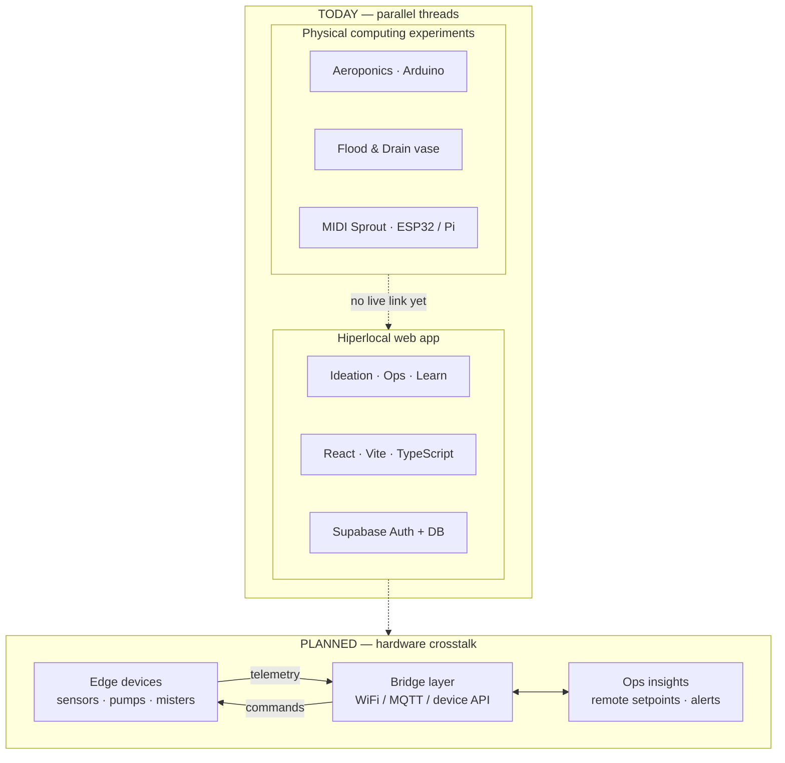
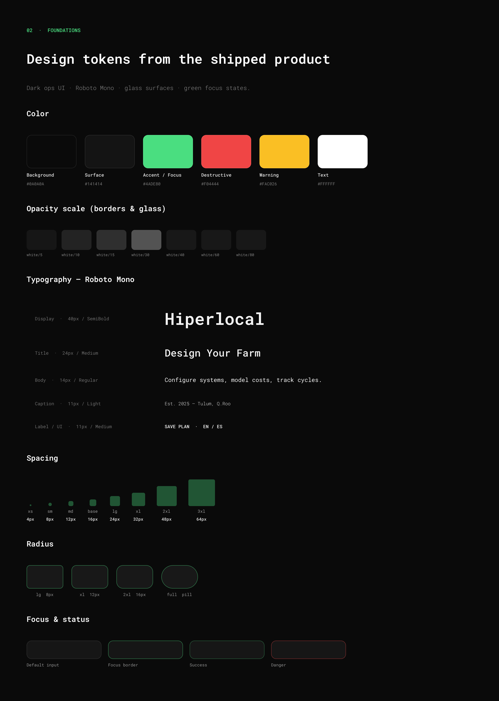
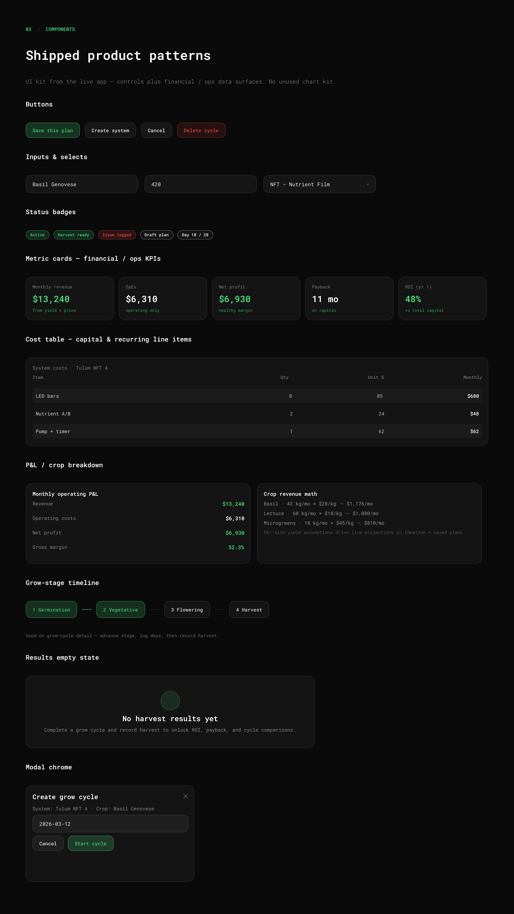

# Hiperlocal

Hiperlocal is a web app for designing, modeling, and running small-scale hydroponic farms — built for hospitality venues, home growers, and commercial operators. It grew out of physical computing experiments (Arduino / ESP32 aeroponics, flood-and-drain, plant bio-sensing) and continues that work online: configure systems, model costs, track grow cycles, and operate saved farms.

Default language is **English** (toggle to Spanish anytime).

## Links

| | |
|---|---|
| **Live app** | [hiperlocal-agtech.vercel.app](https://hiperlocal-agtech.vercel.app/) |
| **Portfolio case study** | [treybradley.xyz/hiperlocal](https://www.treybradley.xyz/hiperlocal) |
| **Design system (Figma)** | [Hiperlocal — Design System & Architecture](https://www.figma.com/design/hD3sFQ2Pc2YU9BhiZHh6Xh) |
| **Source** | [github.com/treybradley/Hiperlocalagtechprod](https://github.com/treybradley/Hiperlocalagtechprod) |

## Architecture

Today the **web app** and **physical computing experiments** run as parallel threads. The dashed bridge is planned: realtime telemetry, analytics, and remote automation.



Portfolio write-up of the physical experiments: [treybradley.xyz/hiperlocal](https://www.treybradley.xyz/hiperlocal).

## Design system

The design system is extracted from the **shipped product**, not a speculative kit. Dark ops surfaces, Roboto Mono, green focus states, and glass chrome stay consistent from Ideation through Operations. Full file: [Figma](https://www.figma.com/design/hD3sFQ2Pc2YU9BhiZHh6Xh).

### Foundations

Near-black canvas (`#0A0A0A`), surface `#141414`, white opacity scale for borders/glass, green accent for focus and positive economics, red for destructive actions. Type is Roboto Mono (light → semibold) with a tight spacing/radius scale (`rounded-xl`–`2xl`, pill badges).



### Components

Controls plus the **financial / ops data surfaces** the product actually uses (no unused chart library):

| Pattern | Role |
|--------|------|
| **Buttons** | Primary (green tint), secondary, ghost, destructive |
| **Inputs & selects** | Dark glass fields, green focus border (`opsFormClasses`) |
| **Status badges** | Active, harvest ready, issue, draft, day counters |
| **Metric cards** | Revenue, OpEx, profit, margin, ROI, payback |
| **Cost tables** | Capital + recurring line items (qty × unit → monthly) |
| **P&L / crop breakdown** | Yield × price → monthly rev; operating P&L stacks |
| **Grow-stage timeline** | Germination → vegetative → flowering → harvest |
| **Results empty state** | Unlock ROI after first completed harvest |
| **Modal chrome** | Create cycle / system flows |



**Figma pages:** Cover · Foundations · Components · Screens · Architecture · Desktop Wireframes (IA only).

### Visual tokens (shipped)

| Token | Value / pattern |
|--------|------------------|
| Typeface | Roboto Mono (300–600) |
| Canvas | Near-black `#0A0A0A`, surfaces `#141414` |
| Accent | Green focus / success (`green-400` / `green-500/50` borders) |
| Chrome | `white/5`–`white/10` borders, glass overlays, `rounded-xl`–`2xl` |
| Ops forms | Shared input/select classes (`opsFormClasses`) |
| Icons | Lucide |

## Features

### Ideation
- **Configurator** — Design a farm layout (system types, environment, lighting, automation, crop mix).
- **Financial calculator** — Startup/operating costs + yield/price assumptions; live monthly profit, ROI, payback.
- **Saved plans** — Sign in to save and reopen from Operations.

### Operations
- **Systems** — Capacity, location, equipment, recurring costs, optional hypothesis.
- **Grow cycles** — Stages, daily logs (metrics, tasks, issues, photos).
- **Harvest & results** — Record harvests; review ROI/payback across cycles.
- **Financial plans** — Browse, duplicate, edit saved projections.

### Learn & About
- Crop database, system types, fundamentals; product story and roadmap.

## Tech stack

| Area | Stack |
|------|--------|
| UI | React, Vite, TypeScript, Tailwind CSS |
| Components | Radix UI, Lucide, Motion |
| Auth & backend | Supabase (Auth, database, edge functions) |
| Local / legacy | IndexedDB (`idb`) |
| State | React context (farm config, auth, language) |

## How to use

1. Open the [live app](https://hiperlocal-agtech.vercel.app/) — English by default (after latest deploy).
2. **Ideation** — configure systems → financial model → optionally save.
3. **Operations** — sign in; manage systems, cycles, logs, harvests, plans.
4. **Learn / About** — reference content and story.
5. Toggle **EN / ES** in the header anytime.

## Local development

```bash
npm install
npm run dev
```

## License / attribution

UI primitives include [shadcn/ui](https://ui.shadcn.com/) components (MIT). See `ATTRIBUTIONS.md`.
